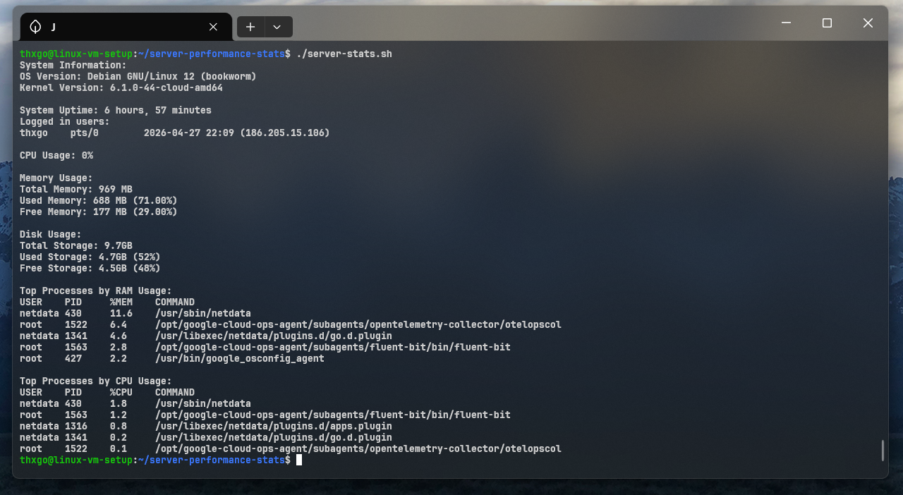

# Server Performance Stats

A shell script to monitor CPU, memory, disk usage and system information on Linux.
Built with cross-distro compatibility in mind, avoiding distribution-specific commands where possible.



## Usage

Clone the repository and give the script execution permission:

```bash
git clone https://github.com/thxgo/server-performance-stats.git
cd server-performance-stats
chmod +x server-stats.sh
./server-stats.sh
```
